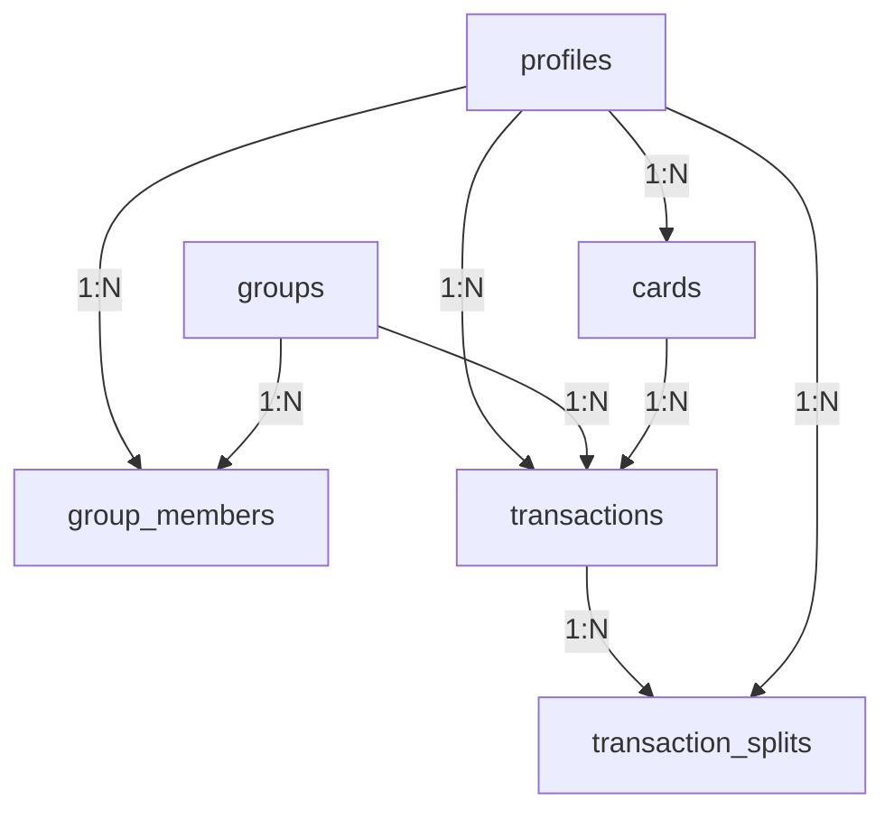

# TripFinance System Design Document

**Date:** 2026-05-26  
**Status:** Approved  
**Topic:** Mobile-first, offline-ready expense tracking app for personal and group/family finances.

---

## 1. Overview
TripFinance is a mobile-first web application designed to track both shared group/family finances and private personal expenses securely. Users log in via Google Auth, can create or join shared "Groups" (which serve as workspaces/family hubs) via an invite/join code, and track individual transactions. 

Personal expenses remain strictly private, while shared expenses belong to a Group. Transactions can be split dynamically among group members, with balances tracked in a normalized database structure to enable fast calculations and prevent data leaks.

---

## 2. Core Features
- **Google Authentication:** Secure login and auto-provisioned user profile.
- **Group Workspaces:** Persistent groups/family hubs (formerly "trips") with join codes.
- **Dynamic Transaction Splitting:** Clear tracking of who paid and exactly who owes what, keeping split calculations lightning-fast.
- **Card Registry & Merged Dropdowns:** Preset card configuration by the group creator, plus private cards added with complete autonomy by users, merged seamlessly in the UI.
- **Personal Dashboard:** Privacy-first workspace to manage solo transactions.
- **Native-Like PWA UX:** Mobile-first layout with safe-area optimizations, animations, and an offline state-caching layer.

---

## 3. Database Schema Design (Supabase PostgreSQL)

### Table Definitions

#### `profiles`
Tracks user profiles tied to Supabase Auth.
- `id` (UUID, Primary Key, references `auth.users`)
- `name` (Text, nullable)
- `created_at` (Timestamp with time zone, default: `now()`)

#### `groups`
Persistent workspaces representing family hubs, travel groups, or sharing boundaries.
- `id` (UUID, Primary Key, default: `gen_random_uuid()`)
- `title` (Text) - E.g., 'Lucas Family Hub' or 'Japan Vacation 2026'
- `join_code` (Text, Unique) - Clean alphanumeric invite code (e.g., `FAM-GOLDEN-42`)
- `preset_card_names` (Text[], default: `'[]'`) - Preset card names defined by the group creator (e.g., `['Amex Gold', 'Chase Sapphire']`)
- `created_by` (UUID, references `profiles`)
- `created_at` (Timestamp with time zone, default: `now()`)

#### `group_members`
Links profiles to their shared workspaces.
- `id` (UUID, Primary Key, default: `gen_random_uuid()`)
- `group_id` (UUID, references `groups` ON DELETE CASCADE)
- `profile_id` (UUID, references `profiles` ON DELETE CASCADE)
- `role` (Text, default: `'member'`) - E.g., `'creator'`, `'member'`
- `created_at` (Timestamp with time zone, default: `now()`)
- *Unique Constraint:* `(group_id, profile_id)`

#### `cards`
Private cards added by individual users for their personal use.
- `id` (UUID, Primary Key, default: `gen_random_uuid()`)
- `user_id` (UUID, references `profiles` ON DELETE CASCADE)
- `card_name` (Text)
- `created_at` (Timestamp with time zone, default: `now()`)

#### `transactions`
Core transaction ledger. Personal expenses have `group_id IS NULL`.
- `id` (UUID, Primary Key, default: `gen_random_uuid()`)
- `amount` (Numeric, scale: 2)
- `description` (Text)
- `payer_id` (UUID, references `profiles` ON DELETE CASCADE)
- `card_id` (UUID, references `cards` ON DELETE SET NULL, nullable)
- `card_name` (Text, nullable) - **Denormalized!** Copied from `cards.card_name` or `groups.preset_card_names` on insert. Solves card reading RLS limits for other group members and eliminates heavy SQL joins.
- `group_id` (UUID, references `groups` ON DELETE CASCADE, nullable)
- `created_at` (Timestamp with time zone, default: `now()`)

#### `transaction_splits`
Normalized individual shares of transactions.
- `id` (UUID, Primary Key, default: `gen_random_uuid()`)
- `transaction_id` (UUID, references `transactions` ON DELETE CASCADE)
- `debtor_id` (UUID, references `profiles` ON DELETE CASCADE) - Who owes the money.
- `amount_owed` (Numeric, scale: 2)
- `is_settled` (Boolean, default: `false`) - Settlement flag to clear balances.
- `created_at` (Timestamp with time zone, default: `now()`)

---

## 4. Row-Level Security (RLS) Policies

To ensure complete data privacy, all tables must have RLS active.

### `profiles`
- **SELECT:** Allowed for authenticated users (`auth.role() = 'authenticated'`).
- **INSERT/UPDATE:** Allowed if user ID matches authenticated user (`auth.uid() = id`).

### `groups`
- **SELECT:** Allowed if the authenticated user is a member of the group (i.e. `auth.uid()` in `group_members` for that group) OR if `created_by = auth.uid()`.
- **INSERT:** Allowed for any authenticated user.
- **UPDATE/DELETE:** Allowed only if `created_by = auth.uid()`.

### `group_members`
- **SELECT:** Allowed if the authenticated user is a member of the group (checks subquery: exists a row with same `group_id` where `profile_id = auth.uid()`).
- **INSERT:** Allowed if the user knows the `join_code` (validated through a Postgres RPC or security trigger).
- **UPDATE/DELETE:** Allowed only if the user is the group creator.

### `cards`
- **ALL:** Allowed only if the card belongs to the current user (`user_id = auth.uid()`). Complete privacy enforcement.

### `transactions`
- **SELECT:** Allowed if `payer_id = auth.uid()` OR if `group_id` is NOT NULL and is a group where the user is a member.
- **INSERT/UPDATE/DELETE:** Allowed only if `payer_id = auth.uid()`.

### `transaction_splits`
- **SELECT:** Allowed if `debtor_id = auth.uid()`, OR if the parent transaction payer is `auth.uid()`, OR if the parent transaction `group_id` is a group where the user is a member.
- **INSERT/UPDATE/DELETE:** Allowed only if the parent transaction `payer_id = auth.uid()`.

---

## 5. UI/UX & Merged Card Selection
- **The Creator's Presets:** Stored in `groups.preset_card_names` (e.g. `['Amex Gold', 'Chase Sapphire']`).
- **The User's Autonomy:** Stored in the private `cards` table.
- **The UI Merge:** When a user opens the "Add Expense" screen in a shared group, the dropdown of card selections is computed on-the-fly:
  `Merged Cards = Group Preset Card Names + User's Private Card Names`
  This allows users to use preset cards or their own custom cards seamlessly without leaking private card registries to other group members.

---

## 6. Offline-Ready State Management
- **Local Cache:** TanStack Query (React Query) manages fetching and caching.
- **State Persistence:** Cache is persisted in `localStorage` or `indexedDB` for offline reads.
- **Optimistic UI:** Expenses are added to the list immediately in the client UI.
- **Sync Queue:** Mutations that fail due to a network connection drop are stored in an `indexedDB` queue, syncing back to Supabase once the client registers a `window.addEventListener('online')` event.
